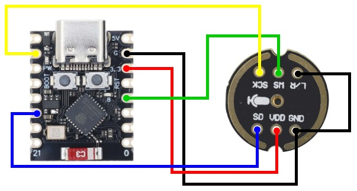

# ESP32-C3-INMP441
A repo to provides a easy guide to connect and use the omnidirectional microphone module INMP441 with the tiny microcontroller ESP32-C3 Super Mini for speech recognition online.

## Server Side (Python)

The server is responsible for receiving the audio stream, detecting voice activity (VAD), processing the audio, and returning the transcribed text.

### How it works
1.  Starts a WebSocket server on port 8888.
2.  Uses a **VAD (Voice Activity Detection)** algorithm based on sound amplitude to identify when the user is speaking.
3.  Temporarily saves the audio as a `.wav` file and runs the **Whisper** model.
4.  Sends the transcription back to the connected client.

### Installation and Execution

**Prerequisites:**
* Python 3.8 or higher.
* **FFmpeg**: Required for Whisper's audio processing.
    * *Windows:* `winget install ffmpeg` (or add it to your PATH manually).
    * *Linux:* `sudo apt install ffmpeg`.

**Step-by-step:**

1.  Install the dependencies:
    ```bash
    pip install -r requirements.txt
    ```

2.  Run the server:
    ```bash
    python ws.py
    ```
    *(On the first run, the script will automatically download the "small" Whisper model).*

---

## Client Side (Arduino / ESP32)

The firmware runs on an **ESP32-C3 SuperMini** and acts as a continuous streaming Wi-Fi microphone.

### Hardware Required
* ESP32 (C3 SuperMini used in this example).
* I2S Omnidirectional Microphone (INMP441).

### Connections (Pinout)
| INMP441 | ESP32-C3 (GPIO) |
| :--- | :--- |
| SCK | 6 |
| WS | 3 |
| SD | 10 |
| L/R | GND (Left Channel) |
| VDD | 3.3V |
| GND | GND |



### Dependencies (Arduino IDE)
Install the following libraries via the **Library Manager**:

1.  **ArduinoWebsockets** by *Gil Maimon*.
2.  **ESP32** board package by *Espressif*.

### Configuration and Upload
1.  Open the `.ino` file.
2.  Edit the Wi-Fi credentials and the Python server IP:
    ```cpp
    const char* ssid = "YOUR_WIFI_SSID";
    const char* password = "YOUR_WIFI_PASSWORD";
    const char* websocket_server_host = "192.168.X.X"; // Your PC IP
    ```
3.  Upload the code to the board.

### How the Firmware works
* Configures the I2S peripheral for Direct Memory Access (DMA) reading.
* Applies a digital software gain to amplify the microphone signal.
* Keeps a WebSocket connection open, sending raw binary data (PCM).
* Receives the response text via the `onMessageCallback` function, where you can implement control logic (e.g., turning on LEDs).

---

## Troubleshooting

* **"FFmpeg not found" error:** Check if FFmpeg is installed and accessible via the terminal (system environment variables).
* **Audio too quiet/loud:** Adjust the `GAIN_FACTOR` constant in the Arduino code.
* **Detection failing:** Adjust the `THRESHOLD` (sensitivity) in the Python code.